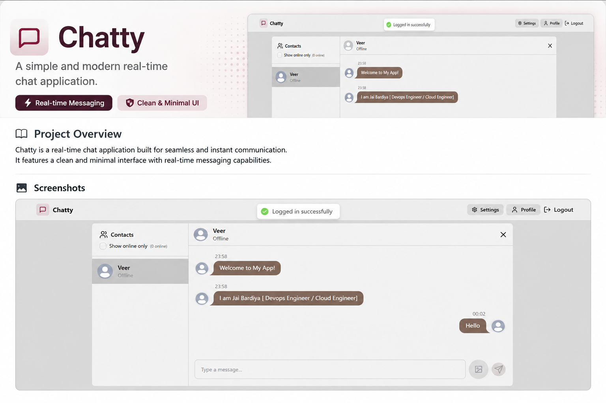
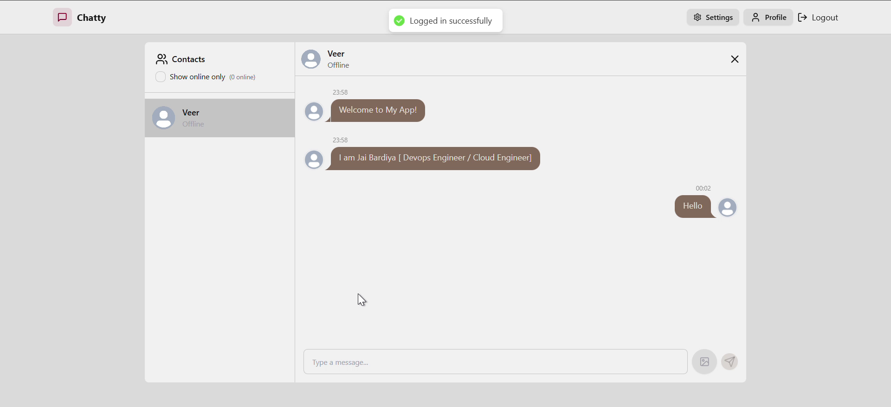

<p align="center">
  
</p>

<h1 align="center">💬 Chatty</h1>

<p align="center">
A modern real-time chat application built with the MERN Stack and Socket.io.
</p>

<p align="center">
  
  
  
  
  
  
  
</p>

---

# ✨ Features

- 🔐 JWT Authentication
- 💬 Real-time Messaging
- 🟢 Online / Offline Status
- 👤 User Profile
- 🖼 Image Sharing
- ⚡ Socket.io Communication
- 📱 Responsive UI
- 🎨 Clean & Minimal Design

---

# 🛠 Tech Stack

### Frontend

- React
- Tailwind CSS
- DaisyUI
- Zustand

### Backend

- Node.js
- Express.js
- MongoDB
- Socket.io
- JWT Authentication

---

# 📸 Application

<p align="center">
  
</p>

---

# 🚀 Installation

Clone the repository

```bash
git clone https://github.com/Jai-Bardiya/Chat-App.git
```

Move into the project

```bash
cd Chat-App
```

Install dependencies

```bash
npm install
```

---

# ⚙️ Environment Variables

Create a `.env` file.

```env
MONGODB_URI=your_mongodb_uri

JWT_SECRET=your_secret_key

PORT=5001

NODE_ENV=development
```

---

# ▶️ Run the Project

Backend

```bash
cd backend
npm run dev
```

Frontend

```bash
cd frontend
npm run dev
```

---

# 🐳 Docker

```bash
docker-compose up --build
```

---

# 📂 Project Structure

```
Chat-App
│
├── backend
│   ├── controllers
│   ├── middleware
│   ├── models
│   ├── routes
│   └── socket
│
├── frontend
│   ├── src
│   ├── components
│   ├── pages
│   └── store
│
└── README.md
```

---

# 🤝 Contributing

Contributions are always welcome.

1. Fork the repository
2. Create a feature branch

```bash
git checkout -b feature-name
```

3. Commit changes

```bash
git commit -m "Add feature"
```

4. Push

```bash
git push origin feature-name
```

5. Open a Pull Request

---

# 📄 License

Licensed under the MIT License.

---

<p align="center">
Made with ❤️ by <b>Jai Bardiya</b>
</p>
